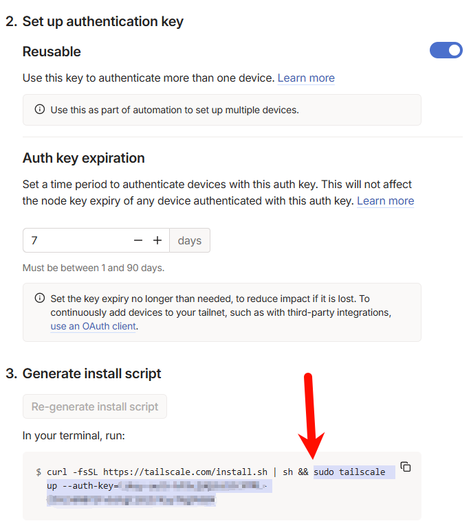

本项目从 [ip_derper](https://github.com/yangchuansheng/ip_derper) 分支而来并独立维护

# IP DERPer Plus

## 使用方法

推荐先使用雨云免费一键部署

> Ads: 雨云优惠码 `wp-admin` 可享新用户 5 折优惠和永久折扣以及消费积分返利

您需要在 Tailscale 控制台生成一个脚本，并且将 `&&` 后的内容复制下来，传入环境变量 `REG_BASH` 中即可

| 环境变量名               | 默认值                               |
|---------------------|-----------------------------------|
| DERP_ADDR           | :443                              |
| DERP_HTTP_PORT      | 80                                |
| DERP_HOST           | 127.0.0.1                         |
| DERP_CERTS          | /app/certs/                       |
| DERP_STUN           | true                              |
| DERP_STUN_PORT      | 3478                              |
| DERP_VERIFY_CLIENTS | false                             |
| REG_BASH            | `echo "No reg bash need to run."` |

